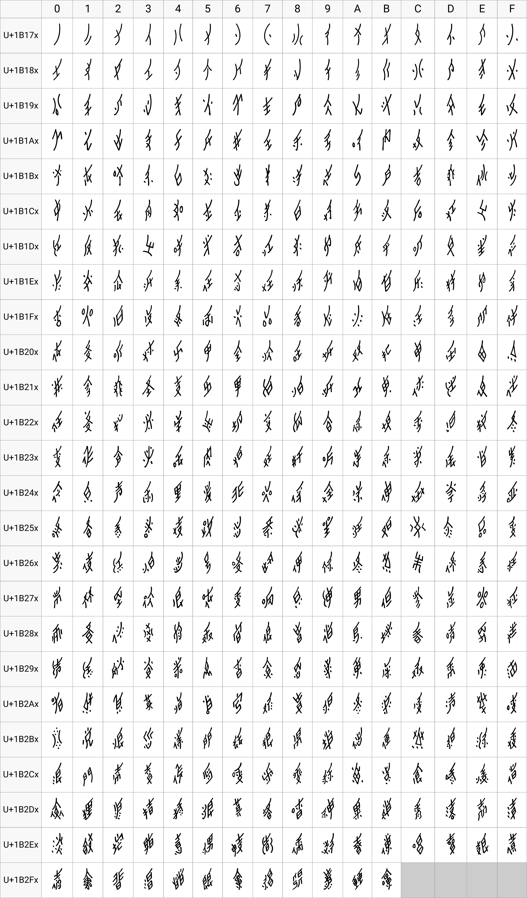

# Unicode Nushu [](https://www.jsdelivr.com/package/gh/nushu-script/font-unicode-nushu)

Unicode Nushu 字体是目前可以显示女书字符的字体，它包括 396 个女书字符和 1 个女书标点。<br>
Unicode Nushu font is a font that can display Nushu characters. It contains 396 Nushu characters and 1 Nushu punctuation.

注意：该字体是从 Unicode V12.1 相关文件中直接提取，版权为字体制作者所有，在线女书字典网站并无该字体的版权，使用时请注意版权问题。<br>
Note: This font is extracted directly from the related files of the Unicode V12.1 standard and is copyrighted by the original authors. It is not copyrighted by the Nushu Coder’s Group on GitHub, so please be aware of copyright issues when using it.

Unicode V12.1 相关文件：<br>
Related files of the Unicode V12.1 standard:

```
https://unicode.org/charts/PDF/U1B170.pdf
https://unicode.org/charts/PDF/U16FE0.pdf
```

## Usage

```css
@import url('https://cdn.jsdelivr.net/gh/nushu-script/font-unicode-nushu@1.0.0/index.css');

:lang(zh-Nshu) {
    font-family: sans-serif, 'Unicode Nushu', sans-serif;
}
```

## Demo


